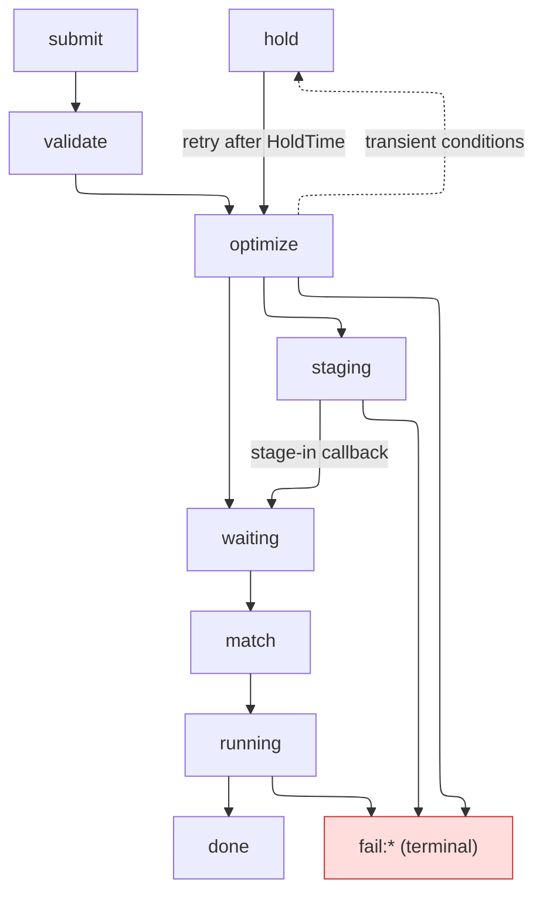

# DiracX Match-making Specification

## 1 Version History

- **v0.1**: Initial proposal (CodiMD note). Preserved as `schema_design-v0.1.md`.
- **v0.2**: Branches-by-discriminator for CPU/GPU; two-tier tag model (DiracX-governed reserved prefixes + opaque VO-namespaced tags); GPU default-deny at submit; flat-key benchmark encoding; committed match-miss diagnostic fidelity.

## 2 Introduction

This document describes:

* The structure of **job scheduling requirements** that jobs provide at submission time.
* The structure of **node specifications** that pilots advertise when they request work.
* How job requirements and node specifications are compared to find suitable matches.
* How multiple eligible jobs are prioritised to pick one per match.

This document does **not** describe:

* How job requirements and node specifications are produced (client-side tooling, pilot-side probes).
* How the matcher is implemented at scale. Some semantic choices are fixed (re-match behaviour, `SharesCorrector` reuse, running-limit cache TTL); the data store, indexing layout, and implementation languages are prototype decisions.
* Pilot submission to batch systems (ARC / HTCondor / Slurm configuration), authentication / authorization, or the CWL data-locality layer (referenced in §11 but not specified here).

Multi-VO and multi-community considerations are addressed inline where relevant (§7 reserved-prefix rationale, §8 ban precedence, §11 terminology). Metadata is generally JSON-like; examples are given as YAML for readability. Where the text says "MUST" / "SHOULD" / "MAY," the meaning is RFC 2119.

## 3 Scale targets

We expect the DiracX matching infrastructure should be able to support:

* 10,000,000 waiting jobs
* 1KHz of sustained job matching requests
* 1,000 distinct sites
* Several hundred custom tags
* The distribution of job metadata and pilot metadata will be extremely non uniform, i.e. the majority of jobs MAY be similar and the majority of jobs MAY run on a small fraction of the distinct resources.
* A long tail of resources and jobs which are niche.

## 4 Pipeline overview



Stages:
- **submit** (structural validation only; fails synchronously with `fail:invalid_spec` on malformed input)
- **optimize** (data locality, site filtering, staging; writes the per-(job, site) eligibility index; transient and terminal outcomes detailed in §8)
- **match** (hardware and tag filtering against pilot ground truth per §7; prioritisation per §9; hardware is resolved here, not in optimize, because the pilot is the only source of truth for which worker node it landed on)
- **running to done** (unchanged from current DIRAC, out of scope).

**Staging** is an indefinite pre-match state. Tape recalls take hours to days; timeout policy does not belong to the matcher. Cleared by the stage-in callback returning the job to the optimizer for re-evaluation.

**Rescheduling dropped; re-optimize retained.** A job returning from a match miss or a transient hold goes back through the optimizer's candidate filtering and re-evaluates site eligibility naturally. No separate rescheduling state or counter in the schema.

## 5 Job Scheduling Requirements

A job submission is a YAML document with the following top-level fields:

| Top-level field | Required | Purpose |
|---|---|---|
| `requirements` | Yes | Hardware / system needs (the block detailed in this section). |
| `sites` | No (advanced) | Allowlist of sites where this job may run. Intended for debugging, site-specific reproduction, or opt-in to restricted partitions. **Normal submissions should omit this**: absent = VO default scope via the optimizer's data-locality resolution. See §8 authoring guidance. |
| `banned_sites` | No (advanced), **mutex with `sites`** | Denylist of sites to exclude from the VO default scope. Intended for known-bad sites from a user's perspective. Submissions setting both `sites` and `banned_sites` are rejected with `fail:invalid_spec`. VO and community bans (§8) already apply globally; normal submissions should omit this. |

The optimizer handles fan-out to candidate sites; the user does **not** duplicate the requirements per site. For the candidate-set formula (how `sites` / `banned_sites` / VO bans compose), see §8.

```yaml
# Expert path: structured fields set directly. Server stores exactly this.
requirements:
  system:
    name: Linux                             # optional; defaults to Linux

  # At least one of cpu_work_db12 / wall_time is required.
  cpu_work_db12: 1000000                    # total DB12 core-seconds; see §5.2
  wall_time: 86400                          # seconds

  cpu:
    num_cores: {min: 1, max: 128}           # optional; VO default → {1, 1}
    ram_mb:                                 # optional; VO default → no constraint
      request:                              # matcher-side budget check
        overhead: 512                       # MB -- startup + non-scaling
        per_core: 256                       # MB per allocated core
      limit:                                # cgroup v2 memory.max enforcement
        overhead: 768
        per_core: 256
    architecture:                           # optional (VO default → reject at submit)
      name: x86_64                          # discriminator; see §5.1
      level: x86-64-v3                      # primary for x86_64 branch
      # Mutually exclusive with `level` on the x86_64 branch.
      # Setting both at schema-validation time -> fail:invalid_spec.
      # Use when the workload needs a feature not captured by any level.
      # required_features: [avx512f]

  gpu:                                      # optional; absent = CPU-only (default-deny
                                            # interpreted at match time -- the record
                                            # is stored exactly as authored)
    vendor: nvidia                          # discriminator (mandatory when block present, count > 0)
    arch: sm_89                             # primary for NVIDIA branch in v0.2
    vram_mb_per_gpu: 16384                  # per-GPU VRAM floor, MB (see §5.1)
    min_runtime_version: "12.0"             # CUDA / ROCm / oneAPI
    count: {min: 1, max: 4}                 # range shape; mandatory when block present

  io:
    scratch_mb: 12040                       # optional; VO default → no floor

  tags: "cvmfs:lhcb & cvmfs:lhcbdev & (os:el9 | os:ubuntu26) & hostfeat:fuse_overlayfs"
  # Two-tier model (§7): reserved prefixes (`os:`, `cvmfs:`, `network:`,
  # `hostfeat:`) are DiracX-governed; other prefixes are opaque VO-local.

# Either `sites` (allowlist) OR `banned_sites` (denylist), not both.
sites: [SiteA]                              # optional allowlist
# banned_sites: [SiteZ]                     # only meaningful when `sites` is unset
```

### 5.0 Mandatory / optional summary (job side)

| Field | Status | Notes |
|---|---|---|
Most fields support a **three-tier fallback**: user-authored → VO default (configured at the deployment) → hardcoded fallback. The hardcoded fallback is named per row below.

| Field | Status | Notes |
|---|---|---|
| `system.name` | Optional | OS-family discriminator. Three-tier fallback: VO default → `Linux`. Every DiracX pilot runs Linux today. |
| `cpu_work_db12` **or** `wall_time` | At least one mandatory | Enforced at submit (§5.2). Both is typical. |
| `cpu.num_cores` | Optional | Range `{min, max}`. Three-tier fallback: VO default → `{min: 1, max: 1}` (single-core, matches most historical DIRAC jobs). |
| `cpu.ram_mb.request` | Optional | Drives budget check (§5.4). Three-tier fallback: VO default → **no constraint** (matcher skips the RAM budget check). Jobs that actually need RAM either author it or OOM at runtime. |
| `cpu.ram_mb.limit` | Optional | Defaults to `request × 1.5` per term; explicit `limit` required if any `request.*` term is 0. |
| `cpu.architecture.name` | Mandatory **unless** the job uses the `arch:*` tag escape hatch (§5.1, §7) | Branch discriminator. The `arch:*` escape covers CPU families not yet in the structured discriminator (e.g. `arch:ppc64le` before a spec bump promotes ppc64le to a branch). Both paths in the same submission = `fail:invalid_spec`. |
| `cpu.architecture.level` (x86_64) / `profile` (aarch64) | Optional | Three-tier fallback: VO default → **reject at submit** (no hardcoded default: architecture is too fundamental for silent defaults; defaulting would silently match against pilots whose ISA the binary doesn't support). x86_64: `level` is the ordered scalar; `required_features` is the escape-hatch list (mutex with `level`). aarch64: `profile` is the ordered scalar (forward-compatible at the baseline); `required_features` layers optional extensions on top (union). |
| **`gpu` (whole block)** | **Optional** | Absent = CPU-only job. The matcher treats absence as "reject any pilot with `gpu.count > 0`" (§5.1 GPU default-deny). The submission record is stored exactly as authored; no server-side stamping. |
| `gpu.vendor`, `gpu.arch`, `gpu.count` | Mandatory when block present and `count.max > 0` | Discriminator + primary. |
| `gpu.vram_mb_per_gpu`, `gpu.min_runtime_version` | Optional | Absent = no per-GPU VRAM floor / no runtime floor. |
| `io.scratch_mb` | Optional | Three-tier fallback: VO default → **no floor** (matcher skips scratch check). |
| `tags` | Optional | Absent / empty = no tag constraint (matches any pilot). Niche in-container capabilities use reserved `hostfeat:*` prefix (§5.3, §7). |
| `sites`, `banned_sites` (top-level) | Optional, **mutually exclusive** | Either `sites` (explicit allowlist) or `banned_sites` (VO scope minus these), not both: a submission setting both is rejected with `fail:invalid_spec`. Absent = VO default scope. |

### 5.1 Branch-by-discriminator (CPU and GPU)

Where hardware is not uniform across families, the schema branches on a discriminator field. Each branch has its own sub-schema with rules appropriate to that architecture. Adding a branch later does not touch existing users' submissions.

**Architecture naming convention (CPU).** `cpu.architecture.name` uses the `uname -m` vocabulary (`x86_64`, `aarch64`, `ppc64le`, `riscv64`). This is the de facto WLCG / HEP convention, observed in LCG platform strings, HEPiX Benchmarking Working Group reports (HEPScore / HS23), HEP_OSlibs metapackages, glibc HWCAPS paths, and archspec. See §6 "Architecture naming: uname -m, not OCI" for the rationale vs OCI naming.

#### CPU

`cpu.architecture.name` is the discriminator. Summary of branches:

| Branch | Status | Primary (ordered comparison) | Secondary | Notes |
|---|---|---|---|---|
| `x86_64` | shipped | `level` scalar (`x86-64-v1..v4`, psABI-defined) | `required_features` (mutex with `level`) | `level` is a strict-superset chain for v1..v4 |
| `aarch64` | shipped | `profile` scalar (`armv8.0-a`, `armv9.0-a`, …) | `required_features` list for optional extensions (union with `profile`) | Profiles ordered at the baseline (`armv9.4-a ⊃ armv9.0-a`); extensions (SVE2, MTE, SME, BF16, …) are NOT ordered and must be listed when used |
| `ppc64le` | escape via `arch:ppc64le` tag | -- |: | Spec bump adds a structured branch when workloads arrive |
| `riscv64` | escape via `arch:riscv64` tag | -- |: | Same |

The `arch:*` reserved tag (§7) is the bootstrap escape for CPU families not yet in the structured discriminator. Jobs use it by omitting the structured `cpu.architecture` block and requiring `arch:<uname-m>` in their tag expression; pilots matching emit the same atom. Graduates to a structured branch when a community commits real work to the architecture.

**x86_64 ordering caveat.** `v1 ⊂ v2 ⊂ v3 ⊂ v4` is a strict superset chain fixed by psABI. A hypothetical `x86-64-v5` could break this if it's not defined as a superset of v4; if that happens, `required_features` replaces `level` as primary. See Appendix A.1 for current v5 discussion status and AVX-512 / consumer-chip specifics.

**aarch64 example.**

```yaml
cpu:
  architecture:
    name: aarch64                            # discriminator
    profile: armv9.0-a                       # primary -- ordered baseline (forward-compatible)
    required_features: [sve2_256, mte]       # layered on top for optional extensions
    # ARM profiles are partially ordered: armv9.4-a's mandatory features ⊃ armv9.0-a's
    # mandatory features, so a v9.0-a binary runs on a v9.4-a CPU. But SVE2 vector
    # lengths, MTE, SME, PAC, BF16 matrix etc. are OPTIONAL even at high profiles --
    # require them explicitly when your binary depends on them.
```

**Combination rules.**

- x86_64: `level` + `required_features` together is **rejected at schema validation** (ambiguous semantics). Power users wanting unusual combinations use the `required_features` escape hatch alone.
- aarch64: `profile` + `required_features` together is valid and **additive**: the profile contributes the baseline feature set, `required_features` adds specific optional extensions on top.
- No `max` on `level` / `profile` / `arch`: binaries are forward-compatible for these dimensions. Unusual "run on exactly v2 for a bug repro" is a tag concern, not a match-making primitive.

#### GPU

`gpu.vendor` is the discriminator. v0.2 ships `nvidia`. `amd` and `intel` branches added when workloads arrive.

| Branch | Primary | Optional | Rationale |
|---|---|---|---|
| `nvidia` | `arch` scalar (`sm_XX`) | (future: `required_features` when a workload needs a specific non-universal feature like TMA on `sm_90`) | `sm_XX` ordering is well-defined in v0.2 scope |
| `amd` (future) | `arch` (`gfxXXXX`) | per-vendor expansion table | `gfxXXXX` is not linearly ordered across product lines; explicit table rather than implicit "newer is better" |

**Field meaning.** `arch: sm_XX` is the CUDA compute capability (`sm_89` ≡ compute capability 8.9 ≡ Ada Lovelace). This replaces v0.1's `compute-capability`: same concept, canonical vendor vocabulary. `min_runtime_version` is the toolkit version (CUDA for NVIDIA, ROCm for AMD, oneAPI for Intel); it is distinct from `arch` because hardware generation (`sm_80` vs `sm_70`: ISA mismatch, launch failure) is independent of toolkit version (old driver refuses a newer module). Both must be satisfied. No `max_runtime_version`: runtimes are forward-compatible for applications.

**`required_features` (future).** Rare NVIDIA features are not ordered by `sm_XX` alone: TMA is sm_90-only, FP8 tensor cores landed on Hopper (sm_90) and Ada (sm_89) but not Ampere (sm_80). v0.2 does not ship `required_features` on the nvidia branch because no current workload needs it at the match level; when one does, the field is added additively (same escape-hatch role as on x86_64). Until then, rare features use VO-coordinated tags (§7).

`vram_mb_per_gpu` is the per-GPU VRAM floor in MB: scalar, matcher-side only. Unlike `ram_mb`, there is no `request/limit` split because no DiracX-integrated enforcer exists for GPU VRAM today. Schema will promote to `{request_mb, limit_mb}` additively when one does (DCGM or equivalent). See Appendix A.4 for background.

**GPU default-deny (match-time rule, no submission mutation).** If a job's `requirements` omits the `gpu` block, the **matcher** treats it as "reject any pilot with `gpu.count > 0`." The submission record is stored exactly as authored: no server-side mutation adds a stamped `gpu: {count: {min: 0, max: 0}}` block. Document fidelity is preserved: `getJob(id)` returns exactly what the user submitted; future debuggers see the authored YAML, not a server-reshaped version. The cost on the matcher is a one-line conditional ("if job has no `gpu` block, skip GPU pilots"), which is cheaper than the alternative of mutating writes at submit time.

Rationale: GPU-equipped nodes are expensive; sites don't want CPU-only jobs landing on them. Default-deny closes two failure modes: (a) a user who forgets the `gpu` block on a CUDA job lands on a CPU pilot and segfaults at launch; (b) a site with an expensive GPU partition has its hardware diluted by CPU-only work.

**Agnostic opt-in (rare, requires site consent).** Some sites run opportunistic GPU farms and permit CPU work to fill idle GPU nodes when GPU demand is low. The job opts in by declaring `count: {min: 0, max: 65535}` **and** requiring the reserved `gpu:opportunistic-cpu-ok` tag; the site controls participation by having its pilots emit the tag only when policy allows:

```yaml
# Job opting into GPU-agnostic placement
gpu:
  count: {min: 0, max: 65535}              # agnostic
tags: "gpu:opportunistic-cpu-ok"           # AND pilot must advertise site consent
```

Sites opt in by asking the DIRAC operator to configure the pilot factory to emit `gpu:opportunistic-cpu-ok`; sites that don't ask don't get the tag, and no job submission can override this. Both halves (job-side agnostic `count`, pilot-side tag) are load-bearing. Current recommendation: **always-on emission at opted-in sites**: GPU jobs are still preferred via §9 tier prioritisation. More elaborate schemes (queue-depth thresholds, per-pilot retry) are possible later without schema changes; see Appendix A.7.

**Archspec expansion.** Jobs author high-level levels (`level: x86-64-v3`, matching compilers); pilots report raw `/proc/cpuinfo` flags. [`archspec`](https://archspec.readthedocs.io) (Spack's library) provides the `level / profile → {feature atoms}` expansion at submit time, cached on each job record (§5.5). The matcher has no runtime dependency on archspec; the match check is a plain `job_features ⊆ pilot_flags` subset comparison. See Appendix A.2 for maintenance status, re-expansion rules (mandatory on aarch64, optional on x86_64 / NVIDIA), and the cost of vendoring if upstream stops.

### 5.2 CPU work and wall time

At least one of `cpu_work_db12` / `wall_time` is required. **For typical CPU-bound HEP jobs, author `cpu_work_db12` alone and omit `wall_time`**: the matcher computes the wall-time budget from `cpu_work_db12 / (allocated_cores × pilot.cpu_power_db12)` and evaluates it against the pilot's allocation. Only I/O-bound or fixed-duration jobs need `wall_time`; authoring both is a paranoid safety for when `cpu_work_db12` is a noisy estimate.

Common authoring patterns:

| Job shape | Author | Don't author | Example |
|---|---|---|---|
| CPU-bound (MC, reconstruction, analysis) | `cpu_work_db12` | `wall_time` (let matcher compute it) | LHCb MCSimulation, stripping |
| I/O-bound / fixed-duration | `wall_time` at `num_cores.min` | `cpu_work_db12` | Rare in HEP: network / service jobs |
| Paranoid (defensive double-fence) | Both | -- | `cpu_work_db12` estimate known noisy |

Field definitions:

- **`cpu_work_db12`**: total DB12 core-seconds of work: `User time + System time` from `/usr/bin/time -v`, summed across cores, normalized to DB12. Authored once, **core-independent**: the total work is the same regardless of how many cores run it. The matcher scales automatically via the formula below.
- **`wall_time`**: flat wall-clock fence on the pilot's allocation. The matcher never scales `wall_time` by `allocated_cores`; the value is taken as-is. Matches Slurm `--time` / HTCondor `+MaxWallTimeMins`: a flat fence is simpler than trying to encode a sublinear speedup curve (Amdahl's law) that the matcher can't know.

Matcher check (with `allocated_cores` from §5.4, reading pilot's `cpu_power_db12`):
- `cpu_work_db12` only → `cpu_work_db12 ≤ pilot.wall_time × pilot.cpu_power_db12 × allocated_cores`
- `wall_time` only → `job.wall_time ≤ pilot.wall_time`
- Both → both must hold

**Units footnote.** `cpu_work_db12` is DB12·core·s (total); `pilot.wall_time` is s; `pilot.cpu_power_db12` is DB12/core; `allocated_cores` is cores. RHS: `s × (DB12/core) × core = DB12·s = DB12·core·s` (treating core-seconds as summed across cores). The `allocated_cores` factor is load-bearing: a reader "simplifying" the formula by removing it would miscount multi-core pilots.

**How to author `cpu_work_db12`.** It is **total** CPU work summed across cores, independent of the core count the payload runs on. Calibration procedure on any reference hardware:

1. Run the payload on a reference machine whose `cpu_power_db12` is known (measured by the DB12 benchmark; pilots measure theirs at startup).
2. Measure CPU time: `User time + System time` from `/usr/bin/time -v`, summed across the cores the payload actually used.
3. `cpu_work_db12 = CPU_time_seconds × reference_cpu_power_db12`.

Worked example: payload runs 1 wall-hour on 8 cores of a reference machine with `cpu_power_db12 = 10`. Total CPU time ≈ 8 × 3600 = 28 800 s. `cpu_work_db12 = 28 800 × 10 = 288 000`. That single number is what the user authors; the matcher then decides independently whether a 4-core / 8-core / 16-core pilot of any `cpu_power_db12` has enough compute in its wall allocation to cover it. Measuring on an 8-core machine does not pin the job to 8-core pilots: it's a one-time calibration.

LHCb production authors derive this from historical measurements per job type; new workloads need a calibration run on a representative pilot.

**Authoring `wall_time`.** Since `wall_time` is not scaled by the matcher, author it at `num_cores.min` (the pessimistic, always-safe choice: longest expected wall-clock across the range). If finer control is needed (e.g. reject 1-core pilots), raise `num_cores.min` instead of trying to encode the intent through `wall_time`.

**Flat-key benchmark encoding.** `cpu_work_db12` and pilot `cpu_power_db12` carry the benchmark name in the field name. When a replacement benchmark is adopted, the schema bumps to add `cpu_work_db27` / `cpu_power_db27` alongside, pilots co-report both during rollover, and the legacy fields retire in a subsequent bump. Ordinary additive evolution; no encoding feature needed.

### 5.3 System: hostfeat tags

```yaml
system:
  name: Linux
```

In-container capability requirements (beyond the OS family) are expressed via the reserved `hostfeat:*` tag prefix (§7). `system.user_namespaces` is **not a structured field** in v0.2 because container isolation is assumed mandatory (§12 #2) and unprivileged user-namespace support is then universally available inside the container. If that assumption is reversed (§12 #2 closes NO), `user_namespaces` returns as a structured boolean.

**`hostfeat:*`**: reserved tag prefix for niche in-container capabilities. Full governance in §7; initial enum:

| Atom | Payload meaning | Pilot detection |
|---|---|---|
| `hostfeat:fuse_overlayfs` | Rootless layered filesystem inside the job | `modprobe fuse-overlayfs`; `/sys/module/overlay/parameters/permit_mounts_in_userns = Y` |
| `hostfeat:io_uring` | Async I/O end-to-end (kernel syscall + seccomp) | `io_uring_setup(1, &p)` returns a valid fd |
| `hostfeat:ptrace` | In-container profiling (`perf`, `strace`) | `CAP_SYS_PTRACE` in container bounding set |
| `hostfeat:net_admin` | Network testing / custom routing inside the job | `CAP_NET_ADMIN` in container bounding set |
| `hostfeat:nested_userns` | Container-within-container (rare; requires host `/proc/sys/user/max_user_namespaces > 0`) | Same probe |

A job requiring any places the atom in its tag expression; a pilot supporting it emits the atom. Same match semantics as any reserved-prefix tag (§7). If a `hostfeat:*` tag is used by 3+ communities with identical pilot-probe semantics, it graduates to a structured `system.*` field in the next minor spec version.

**No `min_glibc` / host-ABI field in v0.2.** Modern DiracX payloads run inside apptainer/singularity containers; the payload's glibc is the container image's, not the host's. A host-glibc match condition is inert for containerised workloads (the majority). The minority cases where host-ABI matters (bare-metal payloads; NVIDIA `--nv` bind-mount workloads where host CUDA libraries are injected into the container) are expressed via tags (`os:el9`, or a community-coordinated `gpu:nv-bindmount-glibc-2.34`-style tag). If measurements later show this routing is inadequate, a `host_glibc` field scoped to bare-metal / host-lib-bound payloads may be added: named by what it actually checks, not by what users assume. See §12 #2 for the container-mandatory question that determines whether this ever returns.

### 5.4 CPU cores, RAM, scratch

**`num_cores: {min, max}`.** Jobs declare a capability range; the pilot advertises a fixed integer; the matcher picks **greedy-to-budget** by solving for the largest `allocated_cores` satisfying all three constraints:

```
allocated_cores ≤ job.num_cores.max              # (or pilot.num_cores if max is null)
allocated_cores ≤ pilot.num_cores
request.overhead + request.per_core × allocated_cores ≤ pilot.ram_mb

# Match succeeds iff allocated_cores ≥ job.num_cores.min.
```

One-shot computation: no per-core loop. **`{min: N, max: N}`** is the strict-pin idiom; **`{min: N, max: null}`** (or `max` omitted) means "no upper bound": authors should set a finite `max` when the payload cannot effectively use more than that many cores, otherwise a 10 000-core pilot is allocated whole. Design principle: the matcher optimizes for pilot fill; fairness is a queue-level concern. See Appendix A.8 for the greedy-to-budget justification.

**`ram_mb: {request, limit}` with `{overhead, per_core}` inside each.**

- **`request`**: matcher-side budget check: `pilot.ram_mb ≥ request.overhead + request.per_core × allocated_cores`.
- **`limit`**: payload-side hard cap, enforced via cgroup v2 `memory.max` (OOM-kills the payload when exceeded; see §12 #3 for enforcement mechanism and §12 #4 for the container-mandatory question).

Static allocations that don't scale with cores (calibration arrays, detector geometry, ML model weights loaded once) fold into `overhead`.

Schema validation: `limit.overhead ≥ request.overhead` and `limit.per_core ≥ request.per_core`. If `limit` is omitted, default is `limit = request × 2` per term (generous, absorbs OOM-kill behaviour); if any `request.*` term is 0, explicit `limit` is MANDATORY (the 2× default would yield 0).

**`io.scratch_mb`**: per-job scratch budget, MB. Treated like `ram_mb` by Slurm (`--tmp`, `$SLURM_TMPDIR`) and HTCondor (`request_disk`, `DISK` per slot); enforcement options for the pilot side in §12 #3.

**No `io.lan_mbitps` in v0.2** (removed from v0.1). Pilots have no truthful bandwidth oracle over a job's lifetime (shared NICs, upstream contention, storage rate-limits). Network class via the `network:*` reserved tag prefix (§7) instead.

### 5.5 Stored form: job record after submit validation and optimize

The authored `requirements` block is stored verbatim (no submit-time mutation); VO defaults resolve at match time. Two additions enrich the record: (1) **archspec expansion** writes `expanded_features` and `archspec_version` at submit; the raw `level` / `profile` is kept for provenance and re-expansion on archspec bump (§5.1, Appendix A.2). (2) **Optimize-time enrichment** writes the per-(job, site) eligibility index after data-locality resolution, `sites` / `banned_sites` / VO bans (§8), and staging handling. Schema validation at submit rejects disallowed combinations (`level` + `required_features` on x86_64; `platform` + `cpu.architecture.*`; `request.*` term zero without explicit `limit`; `sites` and `banned_sites` both set).

The stored form:

```yaml
# Stored shape; users do NOT author this. YAML for readability.

job_id: 12345678
submit_time: "2026-04-23T10:30:17Z"
owner: alice
group: lhcb_user
job_type: MCSimulation
status: waiting                            # staging | hold:* | fail:* | running | done

requirements:                              # exactly what the user authored, plus archspec expansion
  system:
    name: Linux                            # authored (or omitted, then VO default applies at match time)
  cpu_work_db12: 1000000
  wall_time: 86400
  cpu:
    num_cores: {min: 1, max: 128}
    ram_mb:
      request: {overhead: 512, per_core: 256}
      limit:   {overhead: 768, per_core: 256}
    architecture:
      name: x86_64
      level: x86-64-v3                     # authored; retained for provenance
      expanded_features:                   # archspec expansion, cached
        [mmx, sse, sse2, sse3, ssse3, sse4_1, sse4_2,
         popcnt, avx, avx2, bmi2, fma, ...]
      archspec_version: "0.2.4"
  gpu:                                     # only present if the user authored it; absence is default-deny at match time (§5.1)
    vendor: nvidia
    arch: sm_89
    vram_mb_per_gpu: 16384
    min_runtime_version: "12.0"
    count: {min: 1, max: 4}
  io:
    scratch_mb: 12040
  tags: "cvmfs:lhcb & cvmfs:lhcbdev & (os:el9 | os:ubuntu26)"

# Per-(job, site) eligibility populated by the optimizer (§8).
eligibility:
  SiteA: {disk: 5, tape: 0}                # all 5 input LFNs on disk
  SiteB: {disk: 3, tape: 2}                # mixed; staging if no disk-only alternative

optimizer_notes:
  dropped_user_pinned_sites: []            # e.g. ["SiteW"] if banned_sites overlap
  staging_outcome: null                    # or "recalled_at:SiteC"
```

**JobDB storage.** JobDB stores `{level, expanded_features, archspec_version}` (or the aarch64 equivalent with `profile` and `required_features`). `expanded_features` is cached at submit and copied verbatim on rebuild; archspec is not invoked during rebuild. Re-expansion on archspec bumps happens via a scheduled walker (mandatory on aarch64, optional elsewhere; see Appendix A.2).

## 6 Node Specifications

Pilots advertise ground truth observed on the worker node they landed on. Match-time logic compares this against the job's requirements (§5).

**Mandatory / optional summary (pilot side).**

| Field | Status | Notes |
|---|---|---|
| `site` | Mandatory | Matcher routes on it. |
| `system.name` | Mandatory | Node's OS family. |
| `wall_time` | Mandatory | Pilot's allocation budget. |
| `cpu_power_db12` | Mandatory | DB12 per core; matcher evaluates `cpu_work_db12` against this. |
| `cpu.num_nodes`, `cpu.num_cores` | Mandatory | Ground truth; matcher compares directly. |
| `cpu.ram_mb` | Optional (recommended) | Pilot's **allocated** RAM budget, MB (Slurm `--mem`, HTCondor `request_memory`). Absent = matcher skips the `ram_mb.request` check against this pilot. Design question: §12 #4. |
| `cpu.architecture.name`, `cpu.architecture.features` | Mandatory | Discriminator + archspec-normalised feature set. |
| **`gpu` (whole block)** | **Mandatory** | Minimum declaration: `{count: 0}`. Rule below: absence is never valid. |
| `gpu.vendor`, `gpu.arch`, `gpu.vram_mb_per_gpu` | Mandatory when `count > 0` | Matches job-side discriminator / budget fields. |
| `io.scratch_mb` | Optional (recommended) | Pilot's **allocated** scratch budget, MB. Not `df`-output: see "Scratch reporting" below. Absent = matcher skips the job-side `io.scratch_mb` floor for this pilot. |
| `tags` | Optional (MAY be `[]`) | Absent / empty = pilot matches only jobs with no tag constraints. Includes any supported `hostfeat:*` and other reserved-prefix atoms (§7). |

```yaml
site: SiteA
system:
  name: Linux

wall_time: 86400                            # allocation wall budget, seconds
cpu_power_db12: 11.5                        # DB12 per core (canonical benchmark; see §5.2)

cpu:
  num_nodes: 1
  num_cores: 16
  ram_mb: 24576                             # optional -- allocated budget, not df
  architecture:
    name: x86_64
    features: [sse4_2, avx, avx2, bmi2, fma]  # raw /proc/cpuinfo flags vocabulary

gpu: {count: 0}                             # MANDATORY. {count: 0} = explicit no-GPU;
                                            # populated block matching §5.1 otherwise.

io:
  scratch_mb: 40960                         # optional -- allocated budget

tags: [cvmfs:lhcb, cvmfs:lhcbdev, os:el9, network:10gbe, hostfeat:fuse_overlayfs]
```

**Feature vocabulary.** Pilots emit raw `/proc/cpuinfo` flags (plus `lscpu` supplementary fields where appropriate for non-x86 architectures). The matcher normalises to archspec vocabulary at match time using the `{kernel_flag: archspec_name}` mapping table shipped in `diracx-core` and versioned alongside archspec. Mapping lives only on the matcher side: pilots have no archspec dependency and no version-skew failure mode between pilot and matcher. On x86_64 the mapping is near-identity; on aarch64 (kernel-flag names like `asimd`, `sve2` diverge from archspec names) it is load-bearing. The prototype test matrix MUST include at least one aarch64 pilot (a VM with emulated SVE flags suffices for functional testing).

**Architecture naming: `uname -m`, not OCI.** Match-making is pre-image-pull, and every vocabulary the matcher touches (`uname -m`, archspec, glibc HWCAPS, LCG / Spack platform strings) uses `x86_64` / `aarch64` / `ppc64le` / `riscv64`. OCI names (`amd64`, `arm64`) live at the image-pull boundary, downstream of matching. See Appendix A.3 for the full reasoning.

**Multi-node homogeneity.** Assume homogeneous resources across nodes of a multi-node pilot. Heterogeneous multi-node (mixed CPU families or GPU vendors per node) is not supported in v0.2: no current use case; HPC partitions are homogeneous by design. Communities hitting this use a VO-coordinated tag (`node:config1`) on both pilot and job.

**Scratch reporting (allocation-scoped, not `df`).** `io.scratch_mb` MUST be the pilot's **entitled** scratch budget (Slurm `--tmp` value, HTCondor `Disk` slot assignment), not instantaneous `df`. On multi-tenant nodes without per-pilot quotas, the site operator configures a conservative static value (e.g. `total_scratch / max_pilots_per_node`). `df`-based reporting is invalid: its value decreases as neighbours consume scratch.

**Re-match resource reporting.** On a re-match request (pilot requesting a new payload while earlier payloads still run, or after one has completed), all mutable fields (`cpu.num_cores`, `cpu.ram_mb`, `gpu.count`, `io.scratch_mb`) report the pilot's *remaining* capacity. Per-payload accounting is pilot-side; the matcher has no memory across requests (§9).

**Out of scope for v0.2.** Host<->GPU PCIe bandwidth / NVLink topology as numeric values; healthy-score / black-hole prevention (separate proposal); SMT/HT logical-vs-physical distinction; heterogeneous CPUs (P/E cores); fractional CPU / fractional GPU (revisit with an enforcer); external admin operations (killing, drain: owned by WMS ops layer).

## 7 Comparison of Job and Node Metadata

A fixed set of operations. Set operations are avoided to keep the matcher simple (except the boolean-expression combinator over tag atoms).

| Operation | Example | Notes |
|---|---|---|
| Exact match | `pilot.site == job.site` | site, discriminators (architecture.name, gpu.vendor) |
| Range | `job.cpu.num_cores.min ≤ pilot.num_cores ≤ job.cpu.num_cores.max` | elastic shapes |
| Lower limit | `pilot.wall_time ≥ job.wall_time` | monotonic budgets |
| Computed budget | `pilot.ram_mb ≥ job.ram_mb.request.overhead + job.ram_mb.request.per_core × allocated_cores` | §5.4; `limit` is enforcement-side, not matcher-side |
| Branch-specific (ordered) | x86_64: `pilot.level ≥ job.level` | per §5.1 |
| Branch-specific (subset) | aarch64: `job.required_features ⊆ pilot.features` | per §5.1 |
| Tag boolean | `cvmfs:lhcb & (os:el9 \| os:ubuntu26) & ~network:wan-degraded` | literal string equality per atom; AND / OR / NOT combinator with grammar below |

### Tags: two-tier model

Tags are organised into two tiers: **DiracX-governed reserved prefixes** for physical facts that recur across communities, and **opaque VO-namespaced atoms** for community-local use.

**Atom grammar.** Literal string from `[A-Za-z0-9_][A-Za-z0-9_.:/-]*`. Whitespace and operators (`&`, `|`, `~`, `(`, `)`) forbidden inside atoms.

**Expression grammar (job-side).** Boolean expression over atoms. Operators by precedence: `~` (NOT) > `&` (AND) > `|` (OR), left-associative; parentheses override. Whitespace around operators ignored. Empty / absent expression matches all pilots.

**Pilot side.** Flat list of atoms (same grammar). Matching is literal string equality; each atom in the expression is `true` iff the exact string appears in the pilot's set.

**Parsing.** Expression parsed once at submit time into a canonical form; matcher evaluates the canonical form (MUST NOT re-parse on the hot path).

**Reserved prefixes (DiracX-governed).**

| Prefix | Domain | Initial enum / convention |
|---|---|---|
| `os:*` | OS family / distribution | Closed enum: `el9`, `el10`, `ubuntu22`, `ubuntu24`, `ubuntu26`, `debian12`, … |
| `cvmfs:*` | CVMFS repository | Canonical `cvmfs:<repo-fqdn>` (e.g. `cvmfs:lhcb.cern.ch`) |
| `network:*` | Network class / uplink | `10gbe`, `25gbe`, `100gbe`, `infiniband`, `lhcopn`, `lhcone`, `wan-degraded`, … |
| `hostfeat:*` | Niche in-container capabilities (§5.3) | `fuse_overlayfs`, `io_uring`, `ptrace`, `net_admin` |
| `gpu:*` | GPU-side concerns outside the structured `gpu` block | `opportunistic-cpu-ok` (§5.1); future driver-avoidance atoms |
| `arch:*` | CPU architecture escape hatch (§5.1) | Canonical `arch:<uname-m>` (e.g. `arch:ppc64le`) |

Each reserved prefix has an enum (or canonical-form rule) and grows by PR. Pre-promotion, a community MAY use a VO-namespaced provisional atom (`lhcb:hostfeat:new_thing`) until the PR merges. The governance matters most in multi-VO deployments where divergent spellings silently break cross-VO matching; see Appendix A.6.

**Opaque VO-namespaced atoms.** Everything else is opaque: literal string equality, no DiracX interpretation. Convention: `<community-or-vo>:` prefix (`lhcb:trigger`, `cms:hlt-partition`), not enforced. Pilots claiming tags they don't support is a pilot-side integrity issue (same class as claiming a CVMFS mount that isn't there), out of scope for this spec.

**Structured fields are not tag atoms.** Concepts with a structured field MUST NOT appear as tag atoms; the submit-time validator rejects such collisions.

| Concept | Structured field | Why not a tag (with exceptions) |
|---|---|---|
| `site` | top-level `sites` / `banned_sites` (§5), pilot `site` (§6) | Participates in the optimizer's candidate-set formula (§8), composes with VO/community bans, interacts with `AllowInvalidSites`. Tag-based `~site:X` would be silently broken: pilots don't emit `site:*` as a tag. **No exception.** |
| `cpu.architecture.name` | `cpu.architecture.name` (§5.1) | Discriminator field; selects sub-schema. **Exception:** `arch:*` reserved tag (bootstrap escape) is permitted when a job's CPU family isn't yet in the structured discriminator. Using both in the same submission = `fail:invalid_spec`. |
| `gpu.vendor` | `gpu.vendor` (§5.1) | Discriminator field; selects sub-schema. No tag escape (lower urgency than CPU). |
| `architecture.level` / `profile`, `gpu.arch` | `cpu.architecture.level` / `profile`, `gpu.arch` (§5.1) | Primary comparison fields on the discriminator branch; ordered / archspec-expanded. No tag escape. |
| `num_cores`, `num_cores.max` | `cpu.num_cores` (§5.4) | Elastic range with budgeted allocation (§5.4). No tag escape. |

**The meta-rule.** Each schedulable concept has exactly one expression in the schema: either a structured field or a tag, never both. Structured fields win when the concept is discriminator-like, enumerable at schema time, or participates in optimizer-level logic. Tags (reserved or opaque) win when the concept is free-form or has an unbounded vocabulary. This rule adjudicates every future "should this be a tag or a field?" decision: apply the tests in order, pick the first that fits.

### Edge cases: niche and novel hardware

Tags are the v0.2 escape hatch. Installations running unusual hardware declare an opaque tag on both pilot and job:

- **New CPU architecture**: job omits `cpu.architecture` block, pilot and job both use `arch:*` reserved tag (e.g. `arch:ppc64le`, `arch:riscv64`). See §5.1 and the `arch:*` reserved-prefix row above.
- **Multi-node heterogeneous configuration**: pilot tagged `node:config1` (community-coordinated opaque tag), job requires it.
- **Unusual driver-version avoidance**: `gpu:avoid-driver-535.X` (reserved `gpu:*` prefix, §7) declared on both sides.

When such a configuration becomes broadly needed, a structured field is added by a spec version bump.

## 8 Site filtering and job lifecycle

### Candidate set formula (used by optimizer)

```
user_scope  = sites                     if user set `sites`        (explicit allowlist)
            | VO_SITES \ banned_sites   if user set `banned_sites` (VO scope minus user denylist)
            | VO_SITES                  otherwise                  (dominant case)
candidates  = (user_scope ∩ data_eligible_sites) \ (vo_banned_sites ∪ community_banned_sites)
```

- **`sites` and `banned_sites` are mutually exclusive**: setting both is rejected at submit with `fail:invalid_spec`. The spec forbids the combination to keep user intent unambiguous.
- **Ban precedence: `community > VO > user`.** `community_banned_sites` (dead SE, maintenance, incident) and `vo_banned_sites` (VO admin denylist) both subtract unconditionally. If a user's `sites` allowlist intersects either, the overlap is silently dropped and a non-fatal warning is emitted (same pattern as DIRAC's "Applied Default CPU time"). Hard-fail only when the candidate set empties: `fail:impossible_input_data_site` or `fail:all_sites_banned`. Single-VO communities (e.g. LHCbDIRAC) see community and VO bans collapse into one list operationally.
- **`AllowInvalidSites` is per-VO configuration.** VO admins decide whether users pinning dead sites are held pending reactivation (default `True`) or hard-failed (`False`). Not per-submission.
- **Site-level bans use the structured fields only.** Per §7 "One way to do it," tag-based site exclusion is not supported; pilots do not emit `site:*` atoms.

**Authoring guidance.** Normal submissions should omit both `sites` and `banned_sites`. Data-locality routing is the optimizer's job, VO bans are the VO admin's job, community bans are the deployment operator's job. User-level pinning exists for debugging (reproduce at a specific site), opt-in to a restricted partition, or opt-out of a known-bad site (pending a VO-level ban). Users should report broken sites to their VO admin rather than ban them individually.

### Matcher outcomes (post-`waiting`)

The matcher's impossibility story is inherently probabilistic: in a late-binding system, DiracX cannot know at submit time whether a given site will deploy ARM nodes tomorrow.

1. **Hardware mismatch per attempt**: normal. Job stays `waiting` for a compatible pilot.
2. **Historical envelope warning (optional, submit-time)**: if a job's hardware falls outside the envelope of what any eligible site's pilots have reported in the last N days, emit a soft warning. Job still queues. Open question: whether to implement this in v0.2 or defer: depends on profiling cost (§12).
3. **TTL (safety net)**: VO-configurable per-job TTL. Jobs remaining `waiting` past TTL transition to `fail:no_match_within_ttl` with the dominant miss reason recorded (§12).

## 9 Job Prioritisation

Candidate filter is done: the matcher has a set of jobs eligible for the arriving pilot after hardware, tag, and policy checks. Priority is lexicographic: first-differentiating level wins.

**Per-job priority dropped.** v0.1 discussed whether each submission could carry its own priority value. Decision: no. Prioritisation uses job type (tiers, optionally weighted-random within a tier) and group shares (SharesCorrector): documented below. Authors wanting higher priority change their job-type or group context; there is no per-submission priority field. This removes a field whose semantics were perpetually ambiguous and concentrates priority policy at the (admin-configurable) job-type and group level.

1. **Running-limit gate.** Jobs whose (site, job_type) running-count would exceed the configured limit are INELIGIBLE for this pilot; they remain queued until the count drops. Default: no limit. Enforcement is best-effort via a short-TTL cache (default 30 s) of `COUNT(Status IN {RUNNING, MATCHED})` from JobDB; overshoot of order `(cache_ttl × match_rate)` is expected. STALLED is excluded (en route to FAILED via StalledJobAgent; ghost-job reclamation happens there). Same pattern as `DIRAC/WorkloadManagementSystem/Client/Limiter.py:185,250`.

2. **Job type.** The admin config (`job_priorities`) is a list whose items are TIERS. Earlier tier wins over later tier absolutely: if any job in tier-1 is eligible, no job from tier-2 is selected.
   - A tier MAY be a bare job-type string (single type alone in that tier), OR
   - A tier MAY be a dict mapping job types to weights, meaning "weighted random within this tier." `{WGProd: 100, MCFastSim: 50}` says WGProd fires 2× as often as MCFastSim when both are eligible and the outer tiers above them yield nothing.

   Weights are relative, not absolute: `{A: 2, B: 1}` and `{A: 200, B: 100}` behave identically.

3. **Group-weighted random selection.** Within a job-type bucket, select weighted by configured group shares. Reuses DIRAC's existing `SharesCorrector` semantics (`DIRAC/WorkloadManagementSystem/private/SharesCorrector.py`; `TaskQueueDB.py:935` uses `ORDER BY RAND() / tq.Priority ASC`). This matches DIRAC's long-standing fairness model without introducing matcher-owned per-owner state. The `group_shares` YAML (below) replaces DIRAC's `/Registry/Groups/<group>/JobShare` CS entries; `SharesCorrector` semantics are preserved, the storage location moves from CS to DiracX config. Migration from DIRAC is a one-shot importer that reads the CS tree into this YAML.

4. **FIFO.** Oldest submission wins as the final tie-breaker.

After a job is picked, §5.4 `num_cores` resolution picks `allocated_cores`. Remaining pilot capacity is handled by **sequential re-match**: the pilot launches the payload via `PoolComputingElement` (or equivalent), and when the payload finishes or frees a slot, the pilot sends a fresh match request advertising its remaining `num_cores`. The matcher treats each request as independent; running-limit, hardware filters, group-weighted selection, and FIFO all re-evaluate naturally on every request. No batch-fill mode in v0.2: a pilot never receives more than one payload per match call.

**Admin configuration shape:**

```yaml
job_priorities:
  # Outer list = TIERS; earlier tier beats later tier absolutely.
  # Each tier is either a string (single type) or a weighted-random dict.
  - MCSimulation                           # tier 1: always wins when eligible
  - WGProduction: 100                      # tier 2: weighted-random group.
    MCFastSimulation: 50                   #   WGProd fires 2× as often as MCFastSim
  - Merge                                  # tier 3: lowest

group_shares:                              # reuses DIRAC's SharesCorrector
  lhcb_user: 100
  lhcb_prod: 200

by_site:
  SiteA:
    running_limits:
      # Either integer (count cap) or {count, cores} -- first to trip
      MCSimulation: {count: 5000, cores: 80000}
      Merge: 200
```

Unset running-limits mean unlimited. When both `count` and `cores` are set, either tripping makes the (site, job_type) ineligible for further match until it drops below the limit.

## 10 Versioning plan (post-prototype)

### Prototype phase: no versioning

v0.2 is a prototype; no pilots or jobs run against it in production. There is no `spec_version` or `spec_provenance` field. The prototype's submissions, pilots, and matcher are all authored against the same spec revision, so rolling-upgrade tolerance is not a v0.2 concern.

### Post-prototype plan (for reference)

Once deployed, versioning will follow semver:

- **Additive-within-branch** (new optional field; new closed-vocab entry without new matcher branching): does **not** bump.
- **New discriminator branch** (e.g. `architecture.name: riscv64`, `gpu.vendor: amd`): bumps **minor**.
- **Unknown discriminator at a matcher**: jobs requiring the unknown discriminator simply don't match any pilot on that matcher (safe: no false matches). Not ingest-rejected: preserves rolling-upgrade tolerance.
- **Breaking change** (field rename, semantic redefinition, removal): bumps **major**. Rare by policy.

## 11 Other requirements

**Input data / data locality.** Declared in the CWL hint one layer up, not in this `requirements` block. The optimizer reads it from CWL and contributes `data_eligible_sites` to §8's candidate formula. This spec covers *what the job needs from hardware*; CWL covers *what the job needs from the data layer*.

**No SE-level matching (decided in v0.1 discussion).** Jobs are matched to sites, not to storage elements. Storage-to-site mapping is the optimizer's data-locality resolution (SE → sites holding the replicas → `data_eligible_sites`), not a matcher concern. This keeps the matcher's surface uniform (jobs match pilots at sites) and avoids imposing SE-level uniformity on sites that legitimately expose multiple SEs with different policies.

## 12 Open questions

1. **Pilot-side enforcement of `ram_mb.limit` and `io.scratch_mb`: mechanism and per-core semantics.** Current production DIRAC pilots do not enforce RAM or scratch caps; leaky payloads can drain their host and crash co-resident payloads on multi-payload pilots. The spec assumes enforcement via container  (cgroup v2 `memory.max` for RAM; filesystem quota or monitor-and-kill for scratch), but the concrete mechanism needs prototype validation.

   Per-core dependency: RAM enforcement MUST scale with `allocated_cores`: `memory.max = limit.overhead + limit.per_core × allocated_cores`, where `allocated_cores` is the output of §5.4's greedy-to-budget resolution. A payload matched at 8 cores gets `overhead + 8 × per_core` MB; at 128 cores, `overhead + 128 × per_core` MB.

   Scratch is currently a flat scalar (`io.scratch_mb`): no per-core dependency. cgroup v2 has no generic disk-space controller, so enforcement options are: (a) per-payload sub-directory with FS-level quota where the batch system supports it, (b) monitor-and-kill if `du` exceeds the budget, (c) trust the payload (current DIRAC behaviour: unsafe for multi-payload pilots). If a future workload needs per-core scratch scaling, the shape promotes to `{overhead, per_core}` the way `ram_mb` already is.

   Prototype deliverable: demonstrate per-payload RAM OOM-kill via container on a representative pilot; describe the scratch-enforcement mechanism chosen and its failure modes on multi-tenant worker nodes.

2. **Apptainer mandatory for payloads: decision pending DiracX-team confirmation.** Already mandatory in LHCbDIRAC. This spec currently assumes the same DiracX-wide, but broader commitment at the DiracX level is not yet confirmed. Two possible answers and their consequences:

   - **YES (mandatory DiracX-wide).** Container ships its own glibc: `min_glibc` stays out of the schema (§5.3). `ram_mb.limit` enforcement via cgroup v2 `memory.max` is uniform across the fleet (§5.4); the four-leaf `{request, limit}.{overhead, per_core}` schema is meaningful because `limit` is enforced, not advisory. Multi-payload-per-pilot isolation is free (one container per payload). OCI image-pull naming (`linux/amd64` etc.) stays downstream of the matcher; schema uses `uname -m` per §6.

   - **NO (optional per deployment).** Bare-metal payloads exist on deployments that haven't adopted container isolation. Consequences: (a) `min_glibc` as an optional field on the job side, matched against `pilot.glibc_version`; (b) `ram_mb.limit` is advisory on non-Singularity pilots: schema stays the same but enforcement gap is documented; (c) multi-payload-per-pilot isolation needs pilot-side bind-mounts + namespace-unshare, or retirement to one-payload-per-pilot.

   Either outcome is expressible within v0.2's schema shape with minor additions (`min_glibc` optional field). The v0.2 prototype should work against the container-mandatory assumption; the decision determines whether §5.3 and §5.4 text stays "mandatory" or softens to "recommended, with fallback."

3. **Multi-binary job submissions: revisit if real workloads arrive.** A single job with builds for multiple hardware profiles (e.g. both CUDA and ROCm) currently requires two separate submissions because `gpu.vendor` is a single-value discriminator. If vendor-heterogeneous workloads emerge, a future spec bump can add a discriminated-union shape that lets one job carry alternative requirement blocks, each matched against compatible pilots. Not adopted in v0.2. See Appendix A.9 for the related discussion on why v0.1's per-site requirements were dropped and why multi-binary (hardware-profile-keyed) would be the cleaner abstraction if this is ever needed (not site-keyed).

4. **Pilot-side `cpu.ram_mb` reporting: mandatory or optional?** v0.2 marks it optional because pilots can't always report a meaningful value when the pilot factory doesn't request a specific amount from the batch system and multiple pilots share a node. Options: required always (site operator configures a static value; may exclude legacy configs), optional with static fallback (v0.2 draft: absent skips the RAM check), or required best-effort (`/proc/meminfo - allocated_by_neighbors` per request: accurate but noisy). Prototype should measure how many grid pilots today can report an allocated value.

5. **Full tag model vs simple AND-list: real-world evidence needed.** v0.2 ships boolean expressions (`&`, `|`, `~`), reserved prefixes, and governance PRs. A simpler alternative: `tags` is a flat list, AND semantics, no operators, no reserved prefixes; OR is simulated by submitting multiple jobs. The prototype should collect concrete use cases during development: does any LHCb / CTAO / Belle II workflow today need OR (`os:el9 | os:ubuntu22`) or NOT at the tag level? If real answers are "rare" or "none," the simpler AND-list suffices for v0.2.

---

## Appendix A: Design notes

Rationale behind decisions in the main spec. Reviewers who accept a decision don't need this; reviewers who want to push back should read the relevant section before proposing changes.

### A.1 x86_64 level ordering and the v5 question

`level` as a scalar works today because `v1 ⊂ v2 ⊂ v3 ⊂ v4` is a strict superset chain fixed by the psABI document. For v4 specifically the rule is unambiguous: if CPUID reports v4, AVX-512F / CD / BW / DQ / VL are guaranteed present; a CPU without AVX-512 is at most v3. Intel Alder Lake was reclassified v3 once AVX-512 was disabled in firmware, and subsequent consumer Intel chips do not ship AVX-512 at all. AMD Zen 4+ does ship AVX-512 and is correctly v4.

**v5 is under discussion (not finalized).** The consensus direction in glibc / LLVM / GCC maintainer conversations is `x86-64-v5 = v4 + AVX10.2` as a strict superset, preserving forward compatibility. Minority proposals exist that would break supersetting (defining v5 around AVX10 without requiring AVX-512). If a final psABI v5 breaks supersetting, the `level` scalar becomes insufficient on the x86_64 branch and `required_features` takes over as primary. No action needed until publication.

### A.2 Archspec role, maintenance, and re-expansion

**Why archspec.** Without it, DiracX would hand-maintain the `level / profile → feature atoms` mapping. Viable (psABI v1..v4 are explicit; ARM profiles are documented) but more upkeep once non-x86 branches arrive. Archspec is a maintenance-avoidance choice, not algorithmic.

**Maintenance status.** Upstream's last tagged release is v0.2.5 (October 2024). The repository is actively maintained: the Spack ecosystem vendors from the main branch, so release cadence is deprioritised while commits continue (Apple M3/M4 support landed Feb 2026; most recent commit April 2026).

**Vendoring cost if upstream stops.** Total content: ~30 features in x86-64 v1..v4 tables (psABI-fixed), ~8 aarch64 profiles (~150 entries), NVIDIA `sm_XX` table (~15 entries), kernel-flag → archspec-name mapping (~30 entries). Roughly ~250 lines of YAML + ~80 lines of Python + ~1 PR/year when a new CPU family lands.

**Re-expansion on archspec bump.**
- **x86_64, NVIDIA `sm_XX`**: expansion fixed by psABI / vendor tables; bumps rarely change any expansion. Re-expansion is **optional** (defer unless a bump's release notes flag a change).
- **aarch64**: archspec's profile-to-feature-name mapping is an interpretation that may evolve (vocabulary additions, atom renames). Re-expansion is **mandatory** on every archspec bump for jobs with `cpu.architecture.name: aarch64`, via a scheduled walker.

### A.3 Architecture naming: why `uname -m`, not OCI

Match-making is pre-image-pull. The matcher asks "does the pilot's CPU support the job's required features?": answered by `uname -m`, `/proc/cpuinfo`, `lscpu`, archspec, glibc HWCAPS (`/lib64/glibc-hwcaps/x86-64-v3/…`), and community build-system platform strings (LCG `x86_64-el9-gcc13-opt`, Spack `x86_64-linux-gnu`). All of these use `x86_64` / `aarch64` / `ppc64le` / `riscv64`. The psABI microarchitecture levels (§5.1, `x86-64-v1..v4`) are defined in this vocabulary and cannot be renamed.

OCI platform strings (`linux/amd64`, `linux/arm64`) surface at image pull time, downstream of matching; Apptainer handle the `x86_64 <-> amd64` / `aarch64 <-> arm64` translation transparently at that layer. Adopting OCI naming at the matcher layer would introduce a translation step at every schema read (archspec call, pilot ground truth, platform parsers) for no runtime benefit, and would produce self-contradictory adjacent fields (`name: amd64` with `level: x86-64-v3`). Mandatory container isolation does not change this: its OCI awareness lives at the image-pull boundary, not at match time. A derived read-only `oci_name` property can be added later if consumer tooling in the OCI orbit needs it; the authored field stays `uname -m`.

### A.4 GPU VRAM: no `request / limit` split in v0.2

The reason `ram_mb: {request, limit}` is meaningful is that `SingularityComputingElement` + cgroup v2 `memory.max` enforces `limit` by OOM-killing payloads. There is no analogous enforcer for GPU VRAM in DiracX today:

- cgroup v2 has no GPU-memory controller.
- NVIDIA MIG (A100/H100+) partitions VRAM at *provisioning time*: the pilot advertises `vram_mb_per_gpu: N` from its MIG slice; that's pilot-side, not payload-side enforcement.
- NVIDIA DCGM can kill processes exceeding a VRAM quota at runtime, but no DiracX integration exists.
- AMD ROCm has similar primitives with the same integration gap.

Declaring `limit` on a field with no enforcer means users tune something that does nothing. For v0.2, `vram_mb_per_gpu` is a single scalar = the floor the payload needs, matcher-side only. When DCGM (or equivalent) enforcement is plumbed in, the schema promotes additively:

```yaml
vram_per_gpu:
  request_mb: 16384
  limit_mb: 20000
```

Discriminator on the shape (scalar vs. map); existing jobs continue to match without rewrite.

### A.5 `ram_mb request / limit` semantics

`request` is the matcher-side budget check (`pilot.ram_mb >= request.overhead + request.per_core × allocated_cores`); `limit` is the payload-side hard cap via cgroup v2 `memory.max`. `memory.high` (throttle-not-kill) is deliberately not used: a leaky payload would stall the pilot rather than free it. Enforcement mechanism and container dependency: §12 #1 and #2.

### A.6 Reserved-prefix governance: why and for whom

The strong version of the argument ("silently breaks cross-community matching") applies mostly to **multi-VO deployments** (one DiracX instance serving several VOs: typical of multi-community setups like GridPP): the VOs share a keyspace, and divergent spellings (`os:el9` vs `os:rhel9`) silently prevent matching jobs from one VO to pilots at a shared site. Reserved prefixes prevent this by fixing the canonical spelling.

**Single-community / single-VO deployments** (e.g. LHCbDIRAC) have no cross-VO matching inside the instance, so the coordination cost within one deployment is lower. Benefits that still apply:

- Within-VO consistency across sites (one canonical spelling instead of per-site drift).
- Shared DiracX documentation: communities onboarding a new deployment start from the same enum rather than reinventing parallel conventions.
- Pilot-image / binary portability if communities ever share pilot infrastructure.

### A.7 GPU opportunistic-CPU: policy variants

Three deployment policies for sites that want opportunistic CPU work on GPU pilots (all implementable without schema changes; pilot-factory configuration, not matcher spec):

1. **Always-on** (current recommendation). Pilot factory emits `gpu:opportunistic-cpu-ok` on every GPU pilot at opted-in sites. GPU jobs preferred via §9 tier prioritisation; CPU opt-in fills when the GPU tier is empty at the moment a pilot requests work.
2. **Threshold-based.** Factory monitors GPU-queue depth and emits the tag only when depth drops below a configured threshold. Site adjusts dynamically to demand.
3. **Per-pilot retry.** Pilot requests work without the tag N times; on retry N+1 it adds the tag. Strongest "stay hungry for GPU work" guarantee; most complex (pilot-side state machine).

The matcher does not distinguish between these: it sees only whether the tag is in the pilot's current tag set when a match request arrives.

### A.8 Greedy-to-budget `num_cores` resolution

Pilot fill vs. speculative reservation. A greedy-only rule (refuse the match outright when the top of the job's `num_cores` range doesn't fit the pilot's RAM) would leave cores on the table whenever a pilot's RAM can't host `max` but can host some intermediate value ≥ `min`. Greedy-to-budget: solving for the largest `allocated_cores` that still fits the RAM budget: preserves pilot fill without asking the matcher to reserve capacity speculatively. Fairness concerns (job presentation order, reserved capacity for small jobs) live at the queue / prioritisation level (§9), not in the allocation-sizing decision.

### A.9 Per-site requirements: v0.1 dropped, not reinstated in v0.2

**Background.** v0.1 addressed multi-site jobs by letting a submission carry multiple copies of the requirement spec, one per site ("several identical matching specifications which all correspond to the same job"). v0.2 replaces this with a single `requirements` block plus optimizer-driven fan-out via `sites` / `banned_sites` and the candidate-set formula in §8. After seeing the v0.2 design, the question came back: should per-site requirement blocks return as an optional "expert" feature, e.g. `site_requirements: {SiteA: {...}, SiteB: {...}}`, with the matcher picking the block matching the pilot's site?

**Decision: not reinstated.**

**Reasoning.**

- **"Expert-only" is not enforceable.** The schema cannot gate a feature on user skill. Anything the schema expresses is available to every user, and non-experts will reach for the most powerful-looking field by default. Any "for experts" framing is a social contract, not a design primitive.

- **Cartesian-product avoidance is a user-education concern, not a schema concern.** A v0.2 job with `tags: "os:el9 | os:ubuntu22"` and `level: x86-64-v3` already expresses a cartesian product: the job claims to work on {el9, ubuntu22} × {any v3 CPU}. Per-site requirements don't eliminate this: they just change what the author enumerates (sites instead of feature combinations). Site enumeration is also brittle: a new site joining the grid requires the user to update their job spec, whereas `os:el9 | os:ubuntu22` picks up any matching new site automatically.

- **CPU / GPU / RAM requirements are payload-intrinsic, not site-dependent.** A payload needs what it needs, regardless of where it runs. Requirements that actually vary per site (CVMFS mounts, OS, network class, scratch size) are already expressible via tags with OR semantics and ordered-comparison fields. This is precisely what v0.2 refactored v0.1 toward, and the move away from per-site specs was intentional.

- **The one legitimate case is multi-binary, not per-site.** A job with builds for both NVIDIA and AMD GPUs could, in principle, run at either vendor's site. In v0.2 the author submits two jobs (one per vendor) because `gpu.vendor` is a discriminator. This is the strongest argument for multi-requirement submissions: but the right abstraction is a discriminated union over hardware profile, matched on hardware capability, *not keyed on site identity*. Site-keyed requirements fail on heterogeneous sites (a site hosting both NVIDIA and AMD pilots); hardware-profile alternatives succeed. If real vendor-heterogeneous workloads emerge, the future spec bump mentioned in §12 #3 covers the use case cleanly without returning to site-keyed requirements.

**Complexity cost that the v0.1 → v0.2 refactor already eliminated.**

- Schema: `requirements` stays a single block instead of `site_requirements: {...}` map, halving or thirding YAML per multi-site job.
- Validation: submit-time check is scoped once, not per site; `fail:invalid_spec` has one scope.
- Optimizer: candidate-set formula intersects a single requirement set with `data_eligible_sites`, instead of per-site requirement-set intersections.
- Matcher hot path: no per-site requirement-block branching.
- UX: one canonical way to express site-aware submissions (structured `sites` + top-level `requirements`). No parallel site-keyed path.

Reinstating per-site requirements as an optional field would re-introduce this complexity for every downstream consumer (client library, submit validator, optimizer, matcher), not just for the submissions that use the feature. Once it's in the schema, every consumer has to handle it.

**When to revisit.** A concrete LHCb or multi-community workload arrives that (a) has multiple hardware-profile builds for the same payload and (b) cannot be expressed via submit-multiple with independent deduplication. At that point, design multi-binary directly (§12 #3) rather than per-site.

---

## Implementation Details

### Definition of Done

- Functional prototype showing new matching methods based on Redis
- Performance test suite for the prototype (based on locust)
- Technical documentation (Redis options, lua requests) and comparative analysis. See which Redis characteristics we should rely on (lot of parameters that can be fine tuned)

### Scope

- Prototyping the data models (job scheduling requirements at submission time, and then after the optimization, and the node specifications)
- Prototyping the logic to match jobs with pilots based on Redis primitives, lua
- Performance test suite of the prototype

What's not part of the student job (at least not a priority):
- The generation of the job/pilot criteria
- The CWL aspects

This should be part of a separate repo, at the end of the internship, we can think on how to add the few lines of logic in `diracx-logic`

### Redis

- use a pixi workspace with redis-server and Locust
- we provide 3-5 of job/pilot yaml files: the student focuses on moving them into Redis and try to play with them (add workers to test the conccurency).
- student builds "dummy framework" to test matching pilot yaml to job yaml (simple lookup in python initially)
    - building functional tests
- student puts jobs into redis and write lua to do matching
    - start with a dumb for loop over matching specs
- start testing scale
- start introducing rate limits/round-robin

### Filling redis (probably a later project)

- replaces the current optimisers
- needs the DFC and CWL to be known
